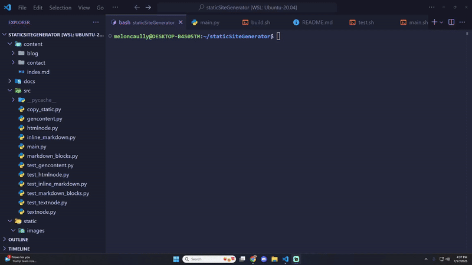

# Static Site Generator
[](https://MelonCaully.github.io/staticSiteGenerator/)

A fast, minimal static site generator powered by Python. This tool parses Markdown files and transforms them into clean, deployable HTML files inside a docs directory — perfect for GitHub Pages or any static hosting. Built for simplicity and extensibility, it's an easy way to turn plain text into polished websites with zero server-side fuss.

<p>
    
</p>

## Motivation

Many developers and content creators need a lightweight way to turn Markdown into HTML without the overhead of full frameworks like Jekyll, Hugo, or anything JavaScript-heavy. This static site generator was built with that in mind:

- Lightweight & Fast: No dependencies, no setup headaches — just Markdown in, HTML out.

- Perfect for GitHub Pages: Outputs to a docs directory for seamless deployment.

- Fully Customizable: Ideal for personal sites, documentation, or blogs where you want full control over structure and styling.

- Educational Value: Designed as a hands-on project to deepen understanding of file I/O, Markdown parsing, and static site architecture.

Whether you're publishing a personal blog or building a portfolio, this tool gives you exactly what you need — and nothing you don’t.

## Usage

<b>Python 3.10 or higher required</b>

! You won't need to download any external packages for python as this project doesn't use any.

Using Linux or Ubuntu, downlaod python in your terminal using the following commands:
```bash
sudo apt update
sudo apt upgrade
sudo apt install python3.10 -y
```
Or go to the [official Python website](https://www.python.org/downloads/) and download the latest version for your operating system.

To build the website to a local server, run the following command in the root of the project:
```bash
./main.sh
```
To build the website to a dedicated server, push the project to your own github repo and change the path in 'build.sh' to the name of the repository you chose. In your repository settings on github navigate to pages and set the source to the main branch and the docs directory and save. Then run the following command in the root of the project and push to github:
```bash
./build.sh
```
Website should now be deployed at the URL https://USERNAME.github.io/REPO_NAME/

## 🤝 Contributing

### Clone the repo

```bash
git clone https://github.com/MelonCaully/staticSiteGenerator
cd staticSiteGenerator
```

### Run the project

```bash
./main.sh
```

### Run the tests

```bash
./test.sh
```

### Submit a pull request

If you'd like to contribute, please fork the repository and open a pull request to the `main` branch.
